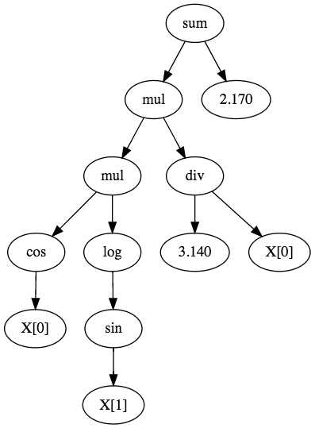

# How it works

## A quick introduction to symbolic regression

!!! info
    If you're looking for an in depth explanation to genetic programming (of which symbolic regression is a subset) check out [*A Field Guide to Genetic Programming*](http://www.gp-field-guide.org.uk/).

Symbolic regression is a subset of genetic programming. It is a supervised learning method where the structure of the model is not fixed. For example in linear regression the model is constrained to have a certain shape, e.g.

$$y = w_0x_0 + w_1x_1 + b$$

In symbolic regression the model can take many shapes. For example the following equation is valid in symbolic regression.

$$y = cos(x_0) \times log(sin(x_1)) \times \frac{3.14}{x_0} + 2.17$$

*Anything goes*. Symbolic regression is thus a very flexible approach. The idea is to run an optimisation procedure to look for the best structure *and* the best parameters. The obvious downside is that the search space becomes huge and unexplorable by standard gradient-based methods.

A symbolic regression model is composed of three different kinds of so-called **operators**:

- **Functions** which are basic mathematical functions such as \\(cos\\) and \\(log\\),
- **Constants** which are simply floating point values such as 3.14 and 2.17,
- **Variables** which are features in a dataset such as \\(x_0\\) and \\(x_1\\).

Each operator, regardless of it's type, has an **arity** which determines how many operands it takes. For example the multiplication operator has an arity of 2. All functions have an arity of 1 or more, whilst constants and variables have an arity of 0. Arity is needed internally to determine if an equation is legal or not. For example a function with an arity of 2 should have two operands. The idea is that an equation can be represented as a tree with each node being an operator and each branch an operand. For example the following tree represents the equation presented above.



!!! info
    This diagram was generated with the [CLI's todot command](cli#visualization).

The goal of symbolic regression is to find an optimal combination of operators. Not only do appropriate operators have to be chosen, they also have to associated in a good way. The search space is very complex and cannot be explored with gradient-based optimization techniques. Instead symbolic regression relies on **evolutionary algorithms** such as **genetic algorithms** (which is what XGP uses) to perform the optimization. Under the hood XGP uses [gago](https://github.com/MaxHalford/gago).

!!! info
    Symbolic regression is part of the larger family of **genetic programming**.

!!! info
    Although they are very close and related, genetic programming and genetic algorithms are different things.

In genetic programming combinations of operators are usually referred to as **programs**. Like other genetic programming methods, the idea with symbolic regression is to **evolve** said programs, hopefully by making them at solving the machine learning task as hand.

The first element needed to perform evolutionary optimization is to define the **fitness** of our programs. In a supervised learning setting this is rather easy; indeed we simply have to "run" a program, get it's output, and compute a so-called **loss metric** by comparing the output to the ground truth. The nice thing is that we can use any loss metric, indeed it doesn't have to be differentiable (which is a requirement of gradient-based optimization).

Once we can evaluate the fitness of a program, we can create a set of random programs and sort them according to their fitness. There are different ways to produce random programs. On the one hand we can generate program trees that have a fixed height; this is called **full initialization**. On the other hand we can generate trees that have variable branch heights; this is called as **grow initialization**. A popular method is to use both methods randomly, which is referred to as **ramped half-and-half initialization**.

Given a set of programs and associated fitnesses, we can generate new programs by combining the ones in the current population. This is called **crossover** and is one of the basic patterns of evolution. The idea is to repeatidly sample two parents from the initial population and produce one (or two, it depends) new programs so as to obtain a new population. Normally, if the sampling is weighted by the fitness of each program, the new population will have a higher average fitness. There are different ways to crossover programs. The most basic one (and the only one implemented in XGP for now) is called **subtree crossover**, it consists in picking random nodes from two programs and swapping them.

New programs can also be generated by sampling individual programs and modifying them. This is called **mutation**. Again, there are different kinds of mutation, of which three are implement in XGP. First of all **point mutation** can be used to modify each operator one-by-one. For example point mutation can be used for tuning the constants. Secondly, **hoist mutation** consists in replacing a branch by one of it's leaves. Finally **subtree mutation** picks a random node in a tree and replaces with a randomly generated tree.

Once a new population has been generated, we can evaluate it and repeat the evolution process. At each so-called **generation** we record the best program and put it aside. Once the process has stopped, either because a set number of generations has occurred or because a desired performance has been reached then the best ever program can be used as the final model.

Of course there is a huge element of randomness to symbolic regression. Whats more there are many choices that have to be made. What operators should one pick? How about what evolution strategy to use? The goal of XGP is to provide a solid framework to work with symbolic regression by providing both an efficient implementation and a high-level API.


## XGP implementation details

The [core of XGP](https://github.com/MaxHalford/xgp) is implemented in Go. Go is a good fit for genetic programming because it's concurrency features play nicely with [embarrassingly parallel](https://www.wikiwand.com/en/Embarrassingly_parallel) situations such as genetic algorithms. Moreover because the running time of symbolic regression grows exponentially with the number of programs, having a compiled implementation saves a lot of time.

XGP's core code is organized in subpackages. The [`op` package](https://github.com/MaxHalford/xgp/tree/master/op) contains all the available operators and the tree structure necessary for building programs. Each operator satisfies the following interface:

```go
type Operator interface {
    Eval(X [][]float64) []float64
    Arity() uint
    Operand(i uint) Operator
    SetOperand(i uint, op Operator) Operator
    Simplify() Operator
    Diff(i uint) Operator
    Name() string
    String() string
}
```

An `Operator` can "evaluate" a matrix and produce a output. The matrix is a set of features oriented column-wise (some would say Fortran style) to optimize the huge amount of columnar operations symbolic regression has to perform. An `Operator` also has an arity and a name. An `Operator` has as many child `Operator`s as it's arity. An `Operator` can also be simplified and differentiated. At first the `Operator` interface seems to require a hefty amount of methods, but in practice it only takes around 100 lines of code to implement.

At a higher-level, a `Program` is what is used to do the actual learning; it has the following signature:

```go
type Program struct {
    Tree      tree.Tree
    Estimator *Estimator
}
```

The `Estimator` gives the `Program` context about what it is it has to learn. The `Estimator` contains a `LossMetric` field with determines how to score each `Program` and if the task is classification or regression. The `Estimator` is also the global structure that organizes the programs and handles the learning process. If you want to use XGP with Go then you'll be working with the `Estimator` struct. However you shouldn't directly instantiate an `Estimator`; instead you should use the `Config` struct where you can speficify training parameters before calling the `NewEstimator` method.

The [`metrics` package](https://github.com/MaxHalford/xgp/tree/master/metrics) is a completely independent package that contains implementations of machine learning metrics (such as accuracy and logarithmic loss). In theory it could be traded for another package if something standardized comes up.

XGP does a few fancy tricks to be competitive:

- Tree simplication: because programs are randomly modified it can occur that some parts of the program can be simplified. For example the formula `add(mul(2, 3), 4)` can simply be replaced by `10`. In practice catching these simplifications and avoiding unnecessary computations helps a lot.
- Regularization: [bloat](http://dces.essex.ac.uk/staff/poli/gp-field-guide/113Bloat.html) is an unavoidable problem in genetic program. As the generations go on the programs will have a tendency to grow in complexity. First of all this increases the running time. It also produces complex programs that tend to overfit. By default XGP uses a **parsimony coefficient** to penalize programs based on the number of operators they possess.
- Constant optimisation: the constants of the best program are "polished" using [CMA-ES](https://www.wikiwand.com/en/CMA-ES). This usually takes a negligible amount of time and helps a lot in practice.
- More coming!
